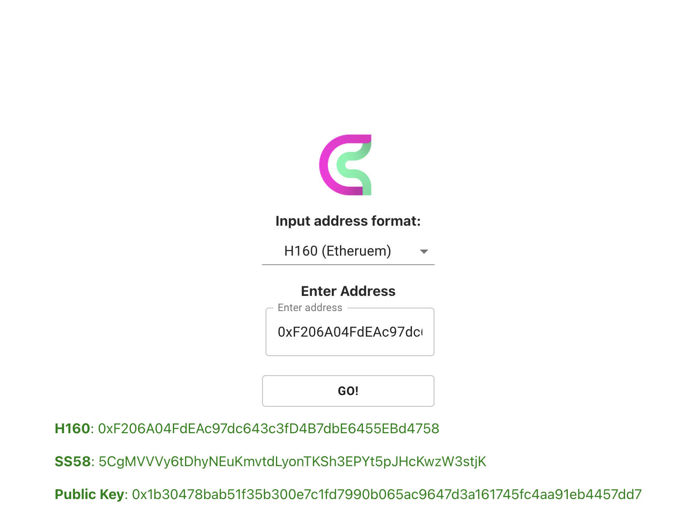

# Accounts Mapping

## Ethereum - Substrate account Mapping

EVM pallet enables the Ethereum EVM capabilities on a native substrate chain. To make use of EVM similar to any EVM-based blockchain, one should understand how an Ethereum account is mapped to the Substrate chain.

## Ethereum / Substrate Address Conversion tool

Head over to the Address Converter to easily convert your Ethereum address to a Substrate address and vice versa.

Just select the input address format from the dropdown and enter the selected input format address in the input field and click on go. For example:

- Select the input address format to H160(ethereum)
- Enter your Ethereum address and click on go
- You will get your equivalent SS58(substrate) address

An example of using the Address Converter can be seen in the image below:

## Ethereum (H160) to Substrate Address Mapping

Every Ethereum address(20-byte) on the EVM is mapped with a unique public key(32-byte) on the Substrate chain, which acts as a proxy to maintain balance for the Ethereum address.

## Balance Mapping

Whenever the base Substrate account is funded with some units a new account is created automatically (if it doesn't exist) & funds will be transferred from the source account to the receiver account.

During any transaction on the EVM, the funds are used by default from the mapped-Substrate address, the EVM always translates the 20-byte Ethereum address to the deterministically generated SS58 address.

If you want to fund the Ethereum address, you need to send tokens to the proxy Substrate address which is linked with your Ethereum address.

> Note that the private key you hold on either Substrate or EVM side will not give you access to the corresponding mapped address on EVM or Substrate respectively.
