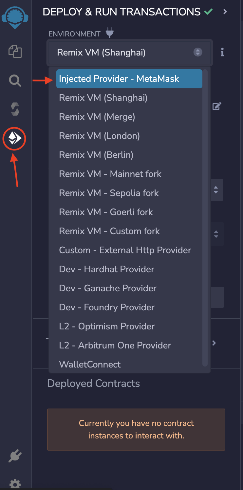
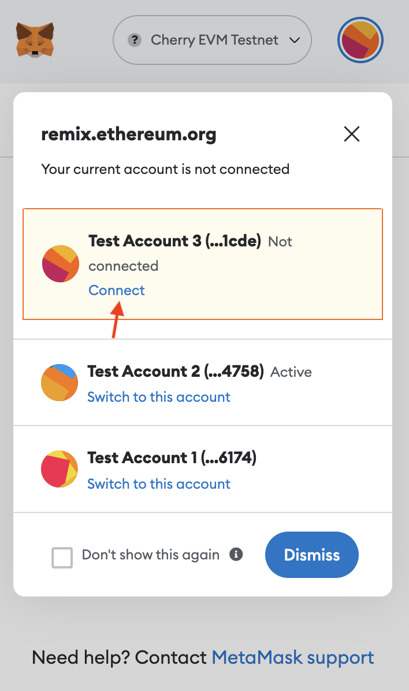

# How to use Remix and the Cherry EVM

Remix is an IDE which makes contract deployment easy and fast. If you want to learn about remix visit [Remix's documentation](https://remix-ide.readthedocs.io/en/latest/index.html).

You can easily connect to Cherry EVM from Remix. Click the "Deploy and run transactions" button (see image below) and open the "environment" dropdown menu. Then choose "Inject Provider - Metamask", and Remix will connect to Cherry EVM.

Then you can connect your account through Metamask. Open Metamask and a message will appear telling you that your account is not connected to Remix. Press the "Connect" button and your account will connect to Remix.

