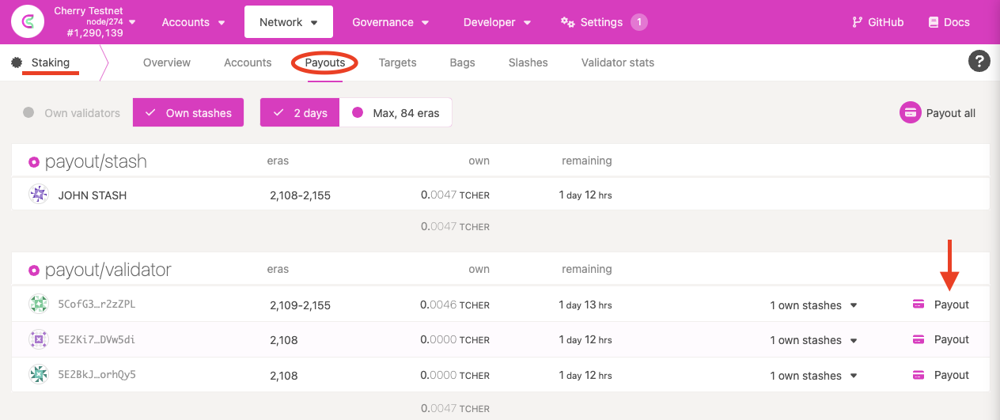

# Consensus

Cherry Network uses NPoS (Nominated Proof-of-Stake) as its consensus mechanism. The system encourages CHER holders to participate as nominators. Nominators may back any number of validators as trusted validator candidates. Both validators and nominators lock their tokens as collateral and receive staking rewards.

The staking system pays out rewards essentially equally to all validators regardless of stake. Having more stake on a validator does not influence the amount of block rewards it receives. However, there is a probabilistic component to the reward calculation so rewards may not be exactly equal for all validators in a given era.

Distribution of the rewards are pro-rata to all stakers after the validator’s commission is deducted. In this way, the network creates incentives for the nomination of lower-staked validators to create an equally-staked validator set.

### How does staking work in Cherry Network?

#### 1. Identifying your role

In staking, you can be either a [nominator](https://docs.cherry.network/cherry-node/consensus/become-a-nominator) or a [validator](https://docs.cherry.network/cherry-node/consensus/become-a-validator).

As a nominator, you can nominate validator candidates that you trust to help you earn CHER rewards. The earned rewards can be bonded (locked) immediately for staking on your stash account which would effectively compound the rewards you receive over time. You could also choose to have them deposited to your controller account as a free (transferable) balance. In Cherry Network, the bonded period (the time that the rewards/tokens are locked) is **28 days.** You can take a look at the nominator docs (link) to understand your responsibilities as a nominator.

#### 2. Staking Rewards Distribution

To explain how rewards are paid to validators and nominators, we need to consider **validator pools**. A validator pool consists of the stake of an elected validator together with the nominators backing it.

If a nominator `n` with stake `s` backs several elected validators, say `k`, the NPoS election mechanism will split its stakes into pieces `s_1`, `s_2`, …, `s_k`, so that it backs validator `i` with stake `s_i`. In that case, nominator `n` will be rewarded essentially the same as if there were `k` nominators in different pools, each backing a single validator `i` with stake `s_i`.

For each validator pool, we keep a list of nominators with the associated stakes.

The general rule for rewards across validator pools is that two validator pools get paid essentially the **same amount of tokens** for equal work, i.e. they are NOT paid proportional to the stakes in each pool. There is a probabilistic component to staking rewards in the form of era points and tips but these should average out over time.

Within a validator pool, a (configurable) percentage of the reward goes to pay the validator's commission fees and the remainder is paid **pro-rata** (i.e. proportional to stake) to the nominators and validator. Notice in particular that the validator is rewarded twice: once in commission fees for validating (if their commission rate is above 0%), and once for nominating itself with stake. If a validator's commission is set to 100%, no tokens will be paid out to any nominations in the validator pool.

To estimate the inflation rate and how many tokens you can get each month as a nominator or validator, you can use this tool as a reference and play around with it by changing some parameters (e.g. how many days you would like to stake your CHER, provider fees, compound rewards, etc.) to have a better estimate. Even though it may not be entirely accurate since staking participation is changing dynamically, it works well as an indicator.

#### 3. Rewards Mechanism

We highlight two features of this payment scheme. The first is that since validator pools are paid the same regardless of stake level, pools with less stake will generally pay more to nominators per-token than pools with more stake.

We thus give nominators an economic incentive to gradually shift their preferences to lower staked validators that gain a sufficient reputation level. The reason for this is that we want the stake across validator pools to be as evenly distributed as possible, to avoid a concentration of power among a few validators.

In the long term, we expect all validator pools to have similar levels of stake with the stake being higher for higher reputation validators (meaning that a nominator that is willing to risk more by backing a validator with a low reputation will get paid more).

The following example should clarify the above. For simplicity, we have the following assumptions:

* These validators do not have a stake of their own.
* They each receive the same number of era points.
* There are no tips for any transactions processed.
* They do NOT charge any commission fees.
* Total reward amount is 100 CHER tokens.
* The current minimum amount of CHER to be a validator is 350 (note that this is _not_ the actual value, which fluctuates, but merely an assumption for purposes of this example; to understand how the actual minimal stake is calculated, see here).

.png>)

_Both validator pools A & B have 4 nominators with the total stake 600 and 400 respectively._

Based on the above rewards distribution, nominators in validator pool B get more rewards per CHER than those in pool A because pool A has more overall stake. Dean has staked 50 CHER in pool A, but he only gets 8.3 in return, whereas Jennie gets 12.5 with the same amount of stake.

There is an additional factor to consider in terms of rewards. While there is no limit to the number of nominators a validator may have, a validator does have a limit to how many nominators to which it can pay rewards.

In Cherry Network, this limit is currently 256, although this can be modified via runtime upgrade. A validator with more than 256 nominators is _oversubscribed_. When payouts occur, only the top 256 nominators, as measured by amount of stake allocated to that validator, will receive rewards. All other nominators are essentially "wasting" their stake - they used their nomination to elect that validator to the active stake, but receive no rewards in exchange for doing so.

We also remark that when the network slashes a validator slot for a misbehavior (e.g. validator offline, equivocation, etc.) the slashed amount is a fixed percentage (and NOT a fixed amount), which means that validator pools with more stake get slashed more CHER. Again, this is done to provide nominators with an economic incentive to shift their preferences and back less popular validators whom they consider to be trustworthy.

The second point to note is that each validator candidate is free to name their desired commission fee (as a percentage of rewards) to cover operational costs. Since validator pools are paid the same, pools with lower commission fees pay more to nominators than pools with higher fees. Thus, each validator can choose between increasing their fees to earn more, or decreasing their fees to attract more nominators and increase their chances of being elected. In the long term, we expect that all validators will need to be cost efficient to remain competitive and that validators with higher reputation will be able to charge slightly higher commission fees (which is fair).

## Accounts

There are two different accounts for managing your funds: `Stash` and `Controller`.

* **Stash:** This account holds funds bonded for staking, but delegates some functions to a Controller. As a result, you may actively participate with a Stash key kept in a cold wallet, meaning it stays offline all the time.
* **Controller:** This account acts on behalf of the Stash account, signalling decisions about nominating and validating. It sets preferences like payout account and commission. If you are a validator, it also sets your session keys. It only needs enough funds to pay transaction fees.

This separation of key types is designated so that validator operators and nominators can protect themselves much better than in systems with only one key. As a rule, you lose security anytime you use one key for multiple roles.

## Slashing

Slashing will happen if a validator misbehaves (e.g. goes offline, attacks the network, or runs modified software) in the network. They and their nominators will get slashed by losing a percentage of their bonded/staked CHER.

Any slashed CHER will be added to the Treasury. The rationale for this (rather than burning or distributing them as rewards) is that slashes may then be reverted by the Council by simply paying out from the Treasury. This would be useful in situations such as a faulty runtime causing slashing or forcing validators offline through no fault of their own. In the case of legitimate slashing, it moves tokens away from malicious validators to those building the ecosystem through the Treasury process.

Validator pools with a larger total stake backing them will get slashed more harshly than less popular ones, so we encourage nominators to shift their nominations to less popular validators to reduce their possible losses.

It is important to realize that slashing only occurs for active validations for a given nominator and slashes are not mitigated by having other inactive or waiting nominations. They are also not mitigated by the validator operator running separate validators; each validator is considered its own entity for purposes of slashing, just as they are for staking rewards.

### Unresponsiveness

For every session, validators will send an "I'm online" heartbeat to indicate they are live. If a validator produces no blocks during an epoch and fails to send the heartbeat, it will be reported as unresponsive. Slashing may occur depending on the repeated offences and how many other validators were unresponsive or offline during the epoch.

Validators should have a well-architected network infrastructure to ensure the node runs to reduce the risk of slashing or chilling. A high-availability setup is desirable, preferably with backup nodes that kick in **only once the original node is verifiably offline** (to avoid double-signing and being slashed for equivocation - see below).

Here is the formula for calculating slashing due to unresponsiveness:

```
Let x = offenders, n = total no. validators in the active set

min((3 * (x - (n / 10 + 1))) / n, 1) * 0.07
```

The examples demonstrate how to calculate the slashing penalty for unresponsiveness.


In all of the examples, assume that there are 100 validators in the active set.


No slashing would enact if < 10% of all validators are unresponsive.

For example, if exactly 10 validators were unresponsive, the expression `3 (x - (n / 10 + 1))) / n would be 3 (10 - (100 / 10 + 1)) / 100 = 3 * (10 - (10 + 1)) / 100 = -0.03` which is rounded to 0.


The minimum value between 0 and 1 is 0. 0 multipled by 0.07 is 0.


If 14 validators are unresponsive, then slashing would occur, as >10% of validators are unresponsive.

The slashing penalty would be `min((3 (14 - (100 / 10 + 1))) / 100, 1) 0.07 = min((3 (14 - 11))/100, 1) 0.07 = min(0.09, 1) * 0.07 = 0.6%`

Similarly, if one-third of the validator set (around 33/100) are unresponsive, the slashing penalty would be about 5%.

The maximum slashing that can occur due to unresponsiveness is 7%. After around 45% of the validators go offline, the expression `3 (x - (n / 10 + 1))) / n will go beyond 1. Hence, min((3 (x - (n / 10 + 1))) / n, 1) * 0.07` will be ceiled to 7%.

### Equivocation

**GRANDPA Equivocation**: A validator signs two or more votes in the same round on different chains.

**BABE Equivocation**: A validator produces two or more blocks on the Relay Chain in the same time slot.

Both GRANDPA and BABE equivocation use the same formula for calculating the slashing penalty:

```
Let x = offenders, n = total no. validators in active set

min( (3 * x / n )^2, 1)
```

As an example, assume that there are 100 validators in the active set, and one of them equivocates in a slot (for our purposes, it does not matter whether it was a BABE or GRANDPA equivocation). This is unlikely to be an attack on the network, but much more likely to be a misconfiguration of a validator. The penalty would be `min(3 * 1 / 100)^2, 1) = 0.0009`, or a 0.09% slash for that validator pool (i.e., all stake held by the validator and its nominators).

Now assume that there is a group running several validators, and all of them have an issue in the same slot. The penalty would be `min((3 * 5 / 100)^2, 1) = 0.0225`, or a 2.25% slash. If 20 validators equivocated, this is a much more serious offence and possibly indicates a coordinated attack on the network, and so the slash would be much greater - `min((3 * 20 / 100)^2, 1) = 0.36`, or a 36% slash on all of these validators and their nominators. All slashed validators will also be chilled.

From the example above, the risks in nominating or running many validators in the active set are apparent. While rewards grow linearly (two validators will get you approximately twice as many staking rewards as one), slashing grows exponentially. A single validator equivocating causes a 0.09% slash, two validators equivocating does not cause a `0.09 * 2 = 0.18%` slash, but rather a 0.36% slash - 4x as much as the single validator.

Validators may run their nodes on multiple machines to make sure they can still perform validation work in case one of their nodes goes down, but validator operators should be extremely careful in setting these up. If they do not have good coordination to manage signing machines, equivocation is possible and equivocation offences are slashed at much higher rates than equivalent offline offences.

If a validator is reported for any one of the offences, they will be removed from the validator set ([chilled](./#chilling)) and they will not be paid while they are out. They will be considered inactive immediately and will lose their nominators. They need to re-issue intent to validate and again gather support from nominators.

If you want to know more details about slashing, please look at the Web3 foundation [research page](https://research.web3.foundation/en/latest/polkadot/slashing/amounts.html).

### Chilling

Chilling is the act of stepping back from any nominating or validating. It can be done by a validator or nominator at any time themselves, taking effect in the next era. It can also specifically mean removal of a validator from the active validator set by another validator, disqualifying them from the set of electable candidates in the next NPoS cycle.

Chilling may be voluntary and validator-initiated, e.g. if there is a planned outage in the validator's surroundings or hosting provider, and the validator wants to exit to protect themselves against slashing. When voluntary, chilling will keep the validator active in the current session, but it will move them to the inactive set in the next. The validator will not lose their nominators.

When used as part of a punishment (initiated externally), being chilled carries an implied penalty of being un-nominated. It also disables the validator for the remainder of the current era and removes the offending validator from the next election.

Polkadot allows some validators to be disabled, but if the number of disabled validators gets too large, Polkadot will trigger a new validator election to get a full set. Disabled validators will need to resubmit their intention to validate and re-garner support from nominators.

## Reward Distribution

Rewards are recorded per session (10 minutes) and calculated per era (1 hour). Rewards are calculated based on era points, which have a probabilistic component. In other words, there may be slight differences in your rewards from era to era and even differences amongst validators in the active set at the same time. These variations should cancel out over a long enough timeline.

In order to be paid your staking rewards, someone must claim them for each validator that you nominate. Staking rewards are kept available for 84 eras. This leads to spreading out reward distribution, as people make transactions at different times, rather than updating the accounts of all stakers in a single block.

Even if everyone submitted a reward claim at the same time, the fact that they are individual transactions would allow the block construction algorithm to process only a limited number per block and ensure that the network maintains a constant block time. If all rewards were sent out in one block, this could cause serious issues with the stability of the network.


**CLAIMING STAKING REWARDS** If nobody claims your staking rewards by this time, then you will not be able to claim them and some of your staking rewards will be lost. Additionally, if the validator unbonds all of their own stake, any pending payouts will be lost. Since unbonding takes 28 days, nominators should check if they have pending payouts at least this often.


### Claiming Rewards

Go to Staking payouts page (see the image below) you will see a list of all the validators that you have nominated and for which you have not yet received a payout. Each validator has an option to trigger the payout for all unclaimed eras. This action will pay everyone who was nominating that validator during those eras (as long as they don't go over the 256 limit) and anyone can call it. Therefore, you may not see anything in this tab, yet still have received a payout if somebody else has triggered the payout for that validator. There is also an option to trigger the payout for all the validators you have nominated for all the unclaimed eras (`Payout all`).



If you wish to check if you received a payout, you will have to check via the block explorer.

Validators can create a cut of the reward (commission) that is not shared with the nominators. This cut is a percentage of the block reward and not an absolute value. After the commission gets deducted, the remaining portion of the block reward is based on their staked value and split between the validator and all of the nominators who have voted for this validator.

For example, assume the block reward for a validator is 100 CHER. A validator may specify `validator_commission = 40%`, in which case the validator would receive 40 CHER. The remaining 60 CHER would then be split between the validator and their nominators based on the proportion of stake each nominator had. Note that validators can put up their own stake, and for this calculation, their stake acts just as if they were another nominator.

Rewards can be directed to the same account (controller), to the stash account (and either increasing the staked value or not increasing the staked value), or to a completely unrelated account. By using the Extrinsics tab (`Developer -> Extrinsics -> Staking -> Bond`) you can also send rewards to "None", effectively burning them. It is also possible to top-up / withdraw some bonded CHER without having to un-stake all staked CHER.

### Inflation

CHER is inflationary. There is no maximum number of CHER. Inflation is designed to be approximately 10% annually, with validator rewards being a function of the amount staked and the remainder going to treasury. The current token supply of CHER is \~760.000.000.

There is an ideal staking rate that the network tries to maintain. The goal is to have the system staking rate meet the ideal staking rate.

The system staking rate would be the total amount staked over the total token supply, where the total amount staked is the stake of all validators and nominators on the network. The ideal staking rate accounts for having sufficient backing of DOT to prevent the possible compromise of security while keeping the native token liquid. An **ideal staking rate of 50% stabilizes the network**. DOT is inflated according to the system staking rate of the entire network.


According to the inflation model, this would suggest that if you do not use your CHER for staking, your tokens dilute over time.


If the amount of tokens staked goes below the ideal rate, then staking rewards for nominators goes up. On the contrary, if it goes above, staking rewards drop. This is a result of the change in the percentage of staking rewards that go to the Treasury. For instance, assuming that the ideal staking rate is 50%, all of the inflation would go to the validators/nominators if 50% of all CHER are staked. Any deviation from the 50% (positive or negative) sends the proportional remainder to the treasury and effectively reduces staking rewards.
