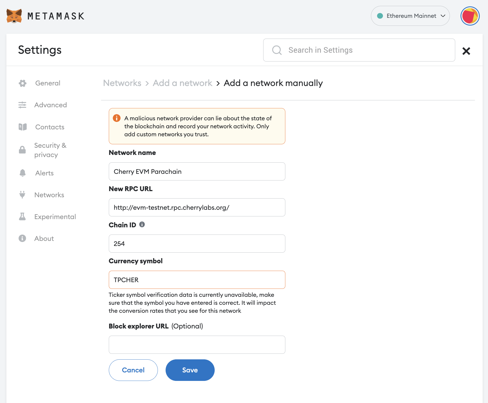

# EVM Compatibility (pEVM)

The EVM Compatibility parachain (pEVM) enables the deployment of smart contracts implemented using Solidity, Vyper, and any other language which can compile smart contracts to EVM-compatible bytecode. This Cherry Network parachain aims to provide a low-friction and secure environment for developing, testing, and executing smart contracts that are compatible with the existing Ethereum developer toolchain.

The execution behavior and semantics of smart contracts based on pEVM will strive to be as close to Ethereum Layer 1 as possible. pEVM is a single shard, so cross-contract calls have the same synchronous execution semantics as on Ethereum Layer 1.

A high-level interaction flow is shown above. A Web3 RPC call from a DApp or existing Ethereum developer tool, such as Truffle, is received by a pEVM node. The node will have both Web3 RPCs and Substrate RPCs available, meaning you can use Ethereum or Substrate tools when interacting with a pEVM node. Associated Substrate runtime functions handle these RPC calls. The Substrate runtime checks signatures and handles any extrinsics. Smart contract calls are ultimately passed to the EVM to execute the state transitions.

By basing our EVM implementation on the Substrate Pallet-EVM, we get a full Rust-based EVM implementation and support from the Parity engineering team.

## Connect to Cherry EVM

#### Cherry Testnet EVM Parachain network details

**Network name**: Cherry EVM Testnet\
**New RPC URL**: http://evm-testnet.rpc.cherrylabs.org/\
**Chain ID**: 254\
**Currency symbol**: tpCHER

