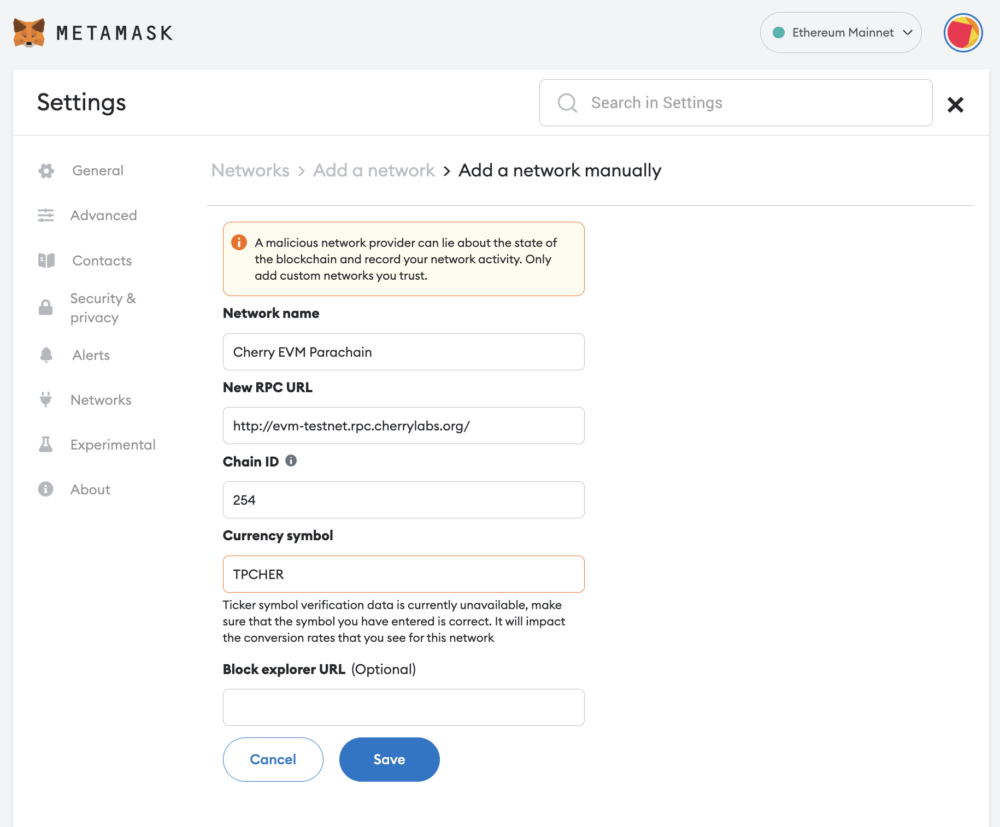

# Connect Metamask

This tutorial will guide you through the process of connecting your MetaMask wallet to Cherry EVM.

If you do not already have MetaMask installed, you can install the extension from the [Chrome Store](https://chrome.google.com/webstore/detail/metamask/nkbihfbeogaeaoehlefnkodbefgpgknn?hl=en). Follow the [Getting Started with MetaMask](https://support.metamask.io/hc/en-us/articles/360015489531-Getting-Started-With-MetaMask) guide from the official MetaMask documentation. Once you have the MetaMask extension, follow the account creation wizard. Store your mnemonic safely, and do not share it with anyone.

## Connect to Cherry EVM

Navigate to the **Add Network** section of MetaMask. You can find it at the bottom of the list of available networks after clicking on the currently active network.

From there, click the **Add a network manually** button at the bottom of the popular custom networks.

This should open up a form to add a new network to your MetaMask (you might have to unlock MetaMask before it opens). Once the form is opened, use the following information to add the Cherry EVM network.

### Cherry Testnet EVM parachain details

**Network name**: Cherry EVM Testnet\
**New RPC URL**: http://evm-testnet.rpc.cherrylabs.org/\
**Chain ID**: 254\
**Currency symbol**: tpCHER

Leave the **Block Explorer URL** empty for now.

Cherry EVM should now be connected, and you should see your tpCHER balance (if you have any).

You will have to [find your Substrate proxy account](account-mapping.md) linked to your MetaMask address in order to see your balance and be able to transfer balances to it.
