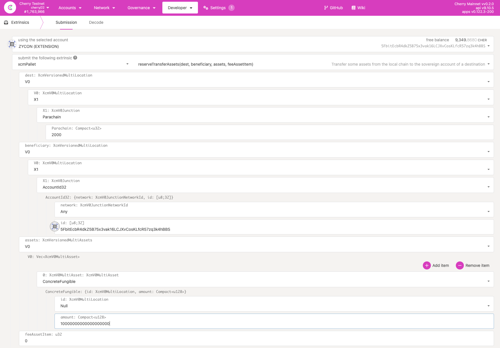
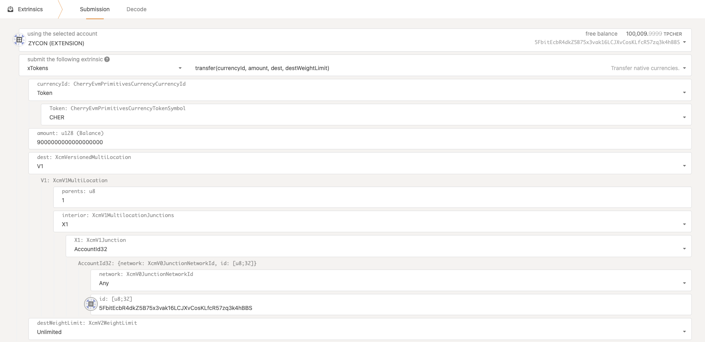
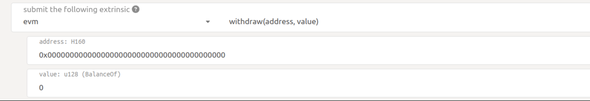

# Token Transfer

With the release of the EVM parachain, users will be able to transfer their CHER tokens (from the relay chain) to the EVM parachain and vice versa. This is possible using **pallet\_xcm** (it can make transfers from the relay to the parachain) and **pallet\_xtokens** (it can make transfers from a parachain back to the relay chain).

The EVM parachain is using its own token called pCHER (1 CHER = 1 pCHER). To get pCHER tokens you will need to transfer your CHER tokens from the relay chain to the EVM compatibility parachain.

### Transfer CHER tokens from the relay chain to the EVM parachain

To transfer your CHER tokens from the relay chain to your **EVM parachain substrate account** you have to navigate to the **Developer** tab and click on the **Extrinsics**. From the dropdown menu (the leftmost one) select the **xcmPallet** and then select the **reserverTransferAssets** function. Then you have to select the options shown below:

**dest**: V0\
**V0**: X1\
**X1**: Parachain\
**Parachain**: 2000

**beneficiary**: V0\
**V0**: X1\
**X1**: AccountId32\
**network**: Any\
**id**: the AccountId of your parachain substrate account

**assets**: V0\
**0**: ConcreteFungible\
**id**: Null\
**amount**: amount of tokens you want to send

Here is an example:



The amount of tokens you want to send requires **ALL** of the token's decimals. If you want to send 100 tokens, the amount you need to input is **100000000000000000000** (100 followed by 18 0s).

### Transfer pCHER back to the relay chain

You can transfer your pCHER from your **EVM parachain substrate account** back to the relay chain. Navigate to the **Developer** tab and click on the **Extrinsics**. From the dropdown menu select the **xTokens** and then select the **Transfer** function. Then you have to select the options show below:

**currencyId**: Token\
**Token**: CHER\
**amount**: amount of tokens you want to send (need all 18 decimals as well)\
**dest**: V1\
**parents**: 1\
**interior**: X1\
**X1**: AccountId32\
**network**: Any\
**id**: the AccountId of your cherry relay account



### Transfer pCHER from Substrate to Ethereum (H160) address

1. Head over to the [address converter](https://converter.cherrylabs.org/).
2. Enter the receiving Ethereum (H160) account address.
3. Copy the mapped Substrate address (SS58) and send the desired amount of PCHER to this address (through a substrate balance transfer transaction).
4. The received PCHER will be shown on the receiver's Ethereum address.

### Transfer pCHER from Ethereum to Substrate address.

1. Head over to the [address converter](https://converter.cherrylabs.org/).
2. Enter the receiving Substrate (SS58) account address.
3. Copy the mapped H160 address and send the desired amount of PCHER to this address (through Metamask).
4.  The receiver should call the `pallet's-evm` `withdraw` function with the following parameters:

    ```bash
    withdraw(
       mapped H160 address (from step 3)
       amount that was transferred (value multiplied by 10^18)
    )
    ```

    
5. The received pCHER will be shown on the receiver Substrate address.
