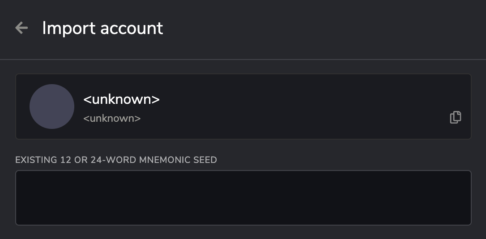

# Create an Account

An address is the public part of a Cherry account. The private part is the key used to access this address. The public and private parts together make up a Cherry account. You need an account to perform any interaction with the Cherry Network.

There are several ways to generate a Cherry account:

* [​Polkadot{.js} Browser Plugin ](https://polkadot.js.org/extension/)- _We recommend this for most users_
* ​[Cherry.Place​](https://cherry.place) - _Cherry Network's blockchain interface_
* ​[Subkey](create-an-account.md#subkey) - _Advanced and Most secure_
* Parity Signer

## Polkadot{.js} Browser Plugin 

The Polkadot{.js} plugin provides a reasonable balance of security and usability. It provides a separate local mechanism to generate your address and interact with Polkadot.This method involves installing the Polkadot{.js} plugin and using it as a “virtual vault," separate from your browser, to store your private keys. It also allows signing of transactions and similar functionality.

It is still running on the same computer you use to connected to the internet with and thus is less secure than using Parity Signer or other air-gapped approaches.

### Install the Browser Plugin 

The browser plugin is available for [both Google Chrome (and Chromium based browsers like Brave) and FireFox.](https://polkadot.js.org/extension/)​ If you would like to know more or review the code of the plugin yourself, [you can visit the Github source repository](https://github.com/polkadot-js/extension).

After installing the plugin, you should see the orange and white Polkadot{.js} logo in the menu bar of your browser.

<figure><figcaption>
Install Polkadot{.js} extension
</figcaption></figure>

### Create Account 

Open the Polkadot{.js} browser extension by clicking the logo on the top bar of your browser. You will see a browser popup, not unlike the one below.

<figure><figcaption></figcaption></figure>

Click the big plus button or select "Create new account" from the small plus icon in the top right. The Polkadot{.js} plugin will then use system randomness to make a new seed for you and display it in the form of twelve words.

<figure><figcaption></figcaption></figure>

You should back up these words as explained above. It is imperative to store the seed somewhere safe, secret, and secure. If you cannot access your account via Polkadot{.js} for some reason, you can re-enter your seed through the "Add account menu" by selecting "Import account from pre-existing seed."

<figure><figcaption></figcaption></figure>

#### Name Account 

The account name is arbitrary and for your use only. It is not stored on the blockchain and will not be visible to other users who look at your address via a block explorer. If you're juggling multiple accounts, it helps to make this as descriptive and detailed as needed.

#### Enter Password 

The password will be used to encrypt this account's information. You will need to re-enter it when using the account for any kind of outgoing transaction or when using it to cryptographically sign a message. Note that this password does NOT protect your seed phrase. If someone knows the twelve words in your mnemonic seed, they still have control over your account even if they do not know the password.

### Use your Account on Cherry Network

Now we will ensure that the addresses are displayed in the Cherry Network format and are imported into the Cherry Network blockchain interface, cherry.place.

Head to [https://cherry.place. ](https://cherry.place)A popup should open requesting you to connect your Polkadot{.js} extension with Cherry.Place

<figure><figcaption></figcaption></figure>

Click _Yes, allow this application access_ to authorize the operation.&#x20;

You are now able to head to [Accounts](https://cherry.place/#/accounts), also found under the Accounts menu entry and see your Polkadot{.js} _Injected_ account.

<figure><figcaption></figcaption></figure>

### Import Chain Properties into Polkadot{.js} 

Head to [the Metadata subsection under the Settings menu item](https://cherry.place/#/settings/metadata), which should look as follows:&#x20;

<figure><figcaption></figcaption></figure>

&#x20;Click _Update metadata_ and accept the subsequent Polkadot{.js} notice in the popup that follows

<figure><figcaption></figcaption></figure>

## Cherry.Place 

> Please note! If you use this method to create your account and clear your cookies in your browser, your account will be lost forever if you do not back it up. Make sure you store your seed phrase in a safe place, or download the account's JSON file if using the Polkadot{.js} browser extension. Learn more about account backup and restoration here.

**Using the Cherry.Place user interface without the plugin is not recommended.** It is the least secure way of generating an account. It should only be used if all other methods are not feasible.

### Open Cherry.Place 

On the [Cherry.place](http://cherry.place) blockchain interface navigate to [Accounts underneath the Accounts menu item. ](https://cherry.place/#/accounts)Click on Add Account, and the screen should appear as follows:

<figure><figcaption></figcaption></figure>

### Account Generation 

The website will guide you through the account creation process. Follow the instructions carefully, and remember to [store your seed safely](create-an-account.md#best-practises)! Make sure to create a strong but memorable password. This password will be required every time you create a transaction or wish to interact with the Cherry Network using this account. It is also required to decrypt the backup file that will be automatically downloaded at the end of the account creation.

<figure><figcaption></figcaption></figure>

### Double, Triple Check! 

Make sure to double and triple-check your copy of the mnemonic. If you lose it or make a mistake while transcribing it, your wallet backup will not work and your CHER may be lost forever!

<figure><figcaption></figcaption></figure>

You should now see your newly created account on your Accounts list.

<figure><figcaption></figcaption></figure>

## Subkey 

Subkey is recommended for technically advanced users who are comfortable with the command line and compiling Rust code. Subkey allows you to generate keys on any device that can compile the code. Subkey may also be useful for automated account generation using an air-gapped device. It is not recommended for general users.

​[You can find detailed build and usage instructions for Subkey here.](https://github.com/paritytech/substrate/tree/master/bin/utils/subkey)​

<figure><figcaption></figcaption></figure>

## Parity Signer

Parity Signer is a mobile application that allows any smartphone to act as an air-gapped crypto wallet. This is also known as "cold storage".

You can create accounts in Substrate-based networks, like Cherry Network, to sign messages/transactions, and transfer funds to and from these accounts without any sort of connectivity enabled on the device.

You must turn off or even physically remove the smartphone's Wifi, Mobile Network, and Bluetooth to ensure that the mobile phone containing these accounts will not be exposed to any online threat. Switching to airplane mode suffices in many cases.

[​You can find detailed build and usage instructions for Parity Signer here. ](https://github.com/paritytech/parity-signer)

<figure><figcaption></figcaption></figure>

## Best Practises

#### **Storing your mnemonic seed**

The seed is your **key** to the account. Knowing the seed allows you, or anyone else, to re-generate and control this account.&#x20;

It is imperative to store the seed somewhere safe, secret, and secure. If you lose access to your account (i.e. you forget the password for your account's JSON file), you can re-create it by entering the seed. This also means anyone else can control your account if they have access to your seed.

For maximum security, the seed should be written down on paper or another non-digital device and stored safely. You may also want to protect your seed from physical damage, as well (e.g. by storing it in a sealed plastic bag to prevent water damage, storing it in a fireproof safe, etching it in metal, etc.) It is recommended that you store multiple copies of the seed in geographically separate locations (e.g., one in your home safe and one in a safety deposit box at your bank). You should not store your seed on any kind of computer that has or may have access to the internet in the future.

#### **Storing your account's backup file** 

The JSON backup file is encrypted with a password, which means you can import it into any wallet which supports JSON imports, but to then use it, you need the password. You don't have to be as careful with your JSON file's storage as you would with your seed (i.e. it can be on a USB drive near you), but remember that in this case, your account is only as secure as the password you used to encrypt it. Do not use easy-to-guess or hard-to-remember passwords. It is good practice to use a [mnemonic password of four to five words](https://xkcd.com/936/). These are nearly impossible for computers to guess due to the number of combinations possible, but they are much easier for humans to remember.

## References 

* ​[Account generation for Polkadot Relay chain](https://wiki.polkadot.network/docs/en/learn-account-generation)​
* ​[SS58 Adress Transform](https://polkadot.subscan.io/tools/ss58\_transform)​
